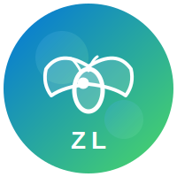

<p align="center">
  
</p>

<h1 align="center">知了论坛</h1>
<p align="center">基于 Uni-App + uView UI 的跨平台社区问答应用 | <strong>v1.0.0</strong></p>

<p align="center">
  <a href="http://8.163.98.227:8083" target="_blank">🌐 H5在线预览</a>
</p>

---

## 📑 目录

-   [✨ 项目亮点](#项目亮点)
-   [技术栈](#技术栈)
-   [🎯 功能特性](#功能特性)
-   [🏗️ 架构设计](#技术架构)
-   [⚡ 快速开始](#快速开始)
-   [📂 项目结构详解](#项目结构)
-   [🎨 主题定制](#主题定制)
-   [🔌 接口文档](#接口文档)
-   [🚀 部署指南](#部署指南)
-   [❓ 常见问题](#常见问题)
-   [📊 性能指标](#性能指标)
-   [🤝 贡献指南](#贡献指南)
-   [📄 许可证](#许可证)
-   [🙏 致谢](#致谢)

---

<a id="项目亮点"></a>

## ✨ 项目亮点

-   🎯 **分包优化**：主包体积 < 1.5MB，通过智能分包实现微信小程序体积限制合规
-   🔧 **多端兼容**：H5 / 微信小程序 / Android / iOS，一套代码覆盖 12+ 平台
-   🧱 **Mixin 复用 + 逻辑去重**：评论交互（点赞/删除/采纳/回复）抽离为 `commentMixin`，消除 info.vue 与 comment.vue 间 ~150 行重复代码；关注/收藏状态通过 `followMixin` + `collectMixin` 统一缓存管理
-   ⚡ **性能优化**：评论懒加载、搜索 300ms 防抖、骨架屏、CSS 异步加载、API preconnect
-   🛡️ **三层错误处理**：页面 try/catch → 请求拦截器 → 全局兜底（Vue errorHandler + unhandledrejection + window.onerror），错误分级分类记录
-   🔐 **安全加固**：XSS 白名单过滤（`sanitize-html.js`）、Token base64 编码 + 过期自动清理、安全 HTTP Headers
-   🔁 **请求重试**：拦截器层面可配置的指数退避重试（500ms/1000ms...），提升弱网体验
-   🧪 **自动化测试**：Jest 7 套件 67 用例，覆盖 Store / 工具函数 / XSS 过滤
-   🔄 **CI 流水线**：GitHub Actions 三阶段（lint → test → build），husky + commitlint + lint-staged 规范提交
-   🎨 **主题系统**：蓝绿渐变配色，SCSS 变量驱动，支持一键换色
-   📡 **PWA 支持**：Service Worker 离线缓存 + Web App Manifest，H5 端可安装到桌面
-   🐳 **Docker 部署**：多阶段构建（node 构建 + nginx 运行），最终镜像 < 20MB

---

<a id="技术栈"></a>

## 技术栈

|         技术          |   版本    | 说明                                 |
| :-------------------: | :-------: | ------------------------------------ |
|      **Vue.js**       |   2.6.x   | 核心框架 (Options API)               |
|      **Uni-App**      |   2.0.2   | 跨平台开发框架                       |
|     **uView UI**      |  2.0.36   | UI 组件库 (全局注册) + HTTP 请求封装 |
|       **Vuex**        |   3.2.x   | 集中式状态管理                       |
|     **SCSS/Sass**     |   1.63+   | CSS 预处理器                         |
| **ESLint + Prettier** | 8.x / 2.x | 代码规范与格式化                     |

### 📱 支持平台

|         平台          |   状态    | 说明                     |
| :-------------------: | :-------: | ------------------------ |
|        **H5**         |  ✅ 推荐  | 完整功能支持，Nginx 部署 |
|    **微信小程序**     | ✅ 已优化 | 分包合规，主包 < 1.5MB   |
| **APP (Android/iOS)** |  ✅ 支持  | HBuilderX 云打包         |
| **支付宝/百度/头条**  |  ✅ 支持  | Uni-App 自动编译适配     |

---

<a id="功能特性"></a>

## 🎯 功能特性

### 👤 用户体系

-   🔐 多端登录（手机号密码 / 微信授权）
-   👤 个人资料编辑（头像上传、昵称、邮箱、地区选择）
-   📍 智能地区选择器（省市区三级联动，127KB 地区数据异步加载）
-   👥 社交关系（关注/取关、粉丝列表、私信中心）

### 📝 帖子模块

-   ✍️ 发布提问（标题、描述、分类、悬赏积分）
-   ✏️ 帖子编辑与详情展示
-   💬 评论系统（递归嵌套、懒加载优化）
-   ⭐ 互动功能（点赞、收藏、采纳最佳回答）

### 💰 商业功能

-   📅 每日签到打卡（日历可视化）
-   💳 积分充值（自定义金额输入）
-   🎁 积分余额管理

### ⚡ 性能优化

-   📦 **分包加载**：主包仅含核心页面，业务模块按需加载
-   🔄 **数据缓存**：Tab 切换避免重复请求
-   🖼️ **图片压缩**：静态资源优化（sharp 自动化处理）
-   🎭 **懒加载**：评论组件按需渲染，提升首屏速度
-   🧹 **前端去重**：关注列表 ID 去重机制

---

<a id="技术架构"></a>

## 🏗️ 架构设计

### 📦 分包策略

```
uni-app_wc/
├── pages/                    # 【主包】核心页面 (< 1.5MB)
│   ├── index/index.vue       # 首页 - 帖子列表
│   ├── post/add.vue          # 发布提问
│   └── business/index.vue    # 我的（会员中心入口）
│
├── pages-post/               # 【分包 1】帖子相关
│   ├── info.vue              # 帖子详情 + 评论系统
│   └── edit.vue              # 编辑提问
│
├── pages-business/           # 【分包 2】用户业务
│   ├── login.vue             # 登录页
│   ├── profile.vue           # 基本资料编辑
│   ├── user.vue              # 个人主页
│   ├── follow.vue            # 关注/粉丝
│   ├── message.vue           # 私信消息
│   ├── pay.vue               # 积分充值
│   ├── checkin.vue           # 每日签到
│   ├── question.vue          # 我的提问
│   └── components/           # 分包内专用组件
│       ├── pick-regions/     # 地区选择器 + regions.json
│       └── calendar/         # 日历组件
│
└── src/components/           # 【公共组件】
    ├── PostItem.vue          # 帖子卡片组件
    └── comment/              # 评论组件（递归嵌套 + 操作菜单）
```

**为什么采用这种架构？**

| 问题                   | 解决方案                                                     | 效果            |
| :--------------------- | :----------------------------------------------------------- | :-------------- |
| 微信小程序主包限制 2MB | 分包拆分业务模块                                             | 主包 < 1.5MB ✅ |
| H5 端路径解析问题      | 公共组件放主包 src/components/，分包组件放分包内 components/ | H5 完全兼容 ✅  |
| 大文件影响首屏加载     | regions.json (127KB) 异步加载                                | 不阻塞渲染 ✅   |
| uView 组件注册失败     | Vue.use(uView) 全局注册                                      | 跨平台稳定 ✅   |

### 🔄 数据流架构

```
用户操作 → Vuex Store → API Request → 后端接口
                ↓
        全局事件总线 ($toast)
                ↓
        页面响应式更新 → UI 渲染
```

**关键模块：**

-   [store/index.js](src/store/index.js) - 用户状态、关注/收藏缓存、安全存储
-   [utils/request.js](src/utils/request.js) - HTTP 拦截器、自动 Token 注入、可配置重试
-   [utils/auth.js](src/utils/auth.js) - 登录检查、用户信息获取
-   [utils/toast.js](src/utils/toast.js) - 全局提示工具（成功/失败/确认弹窗）
-   [utils/debounce.js](src/utils/debounce.js) - 防抖/节流工具
-   [utils/secure-storage.js](src/utils/secure-storage.js) - 安全存储（编码 + 过期校验）
-   [utils/error-handler.js](src/utils/error-handler.js) - 错误处理三层架构
-   [utils/dedupe.js](src/utils/dedupe.js) - 通用列表去重工具
-   [components/PostForm.vue](src/components/PostForm.vue) - 帖子表单组件（发布/编辑复用，含 uView 表单校验）

---

<a id="快速开始"></a>

## ⚡ 快速开始

### 📋 环境要求

|      工具      | 最低版本 |  推荐版本   | 说明              |
| :------------: | :------: | :---------: | ----------------- |
|    Node.js     | >= 14.0  | >= 16.0 LTS | JavaScript 运行时 |
|      npm       |  >= 6.0  |   >= 8.0    | 包管理器          |
|   HBuilderX    |  >= 3.6  |   最新版    | 可选 IDE（推荐）  |
| 微信开发者工具 |  最新版  |      -      | 小程序调试必需    |

### 🚀 安装步骤

```bash
# 1️⃣ 克隆仓库
git clone <repository-url>
cd uni-app_wc

# 2️⃣ 安装依赖（首次约需 3-5 分钟）
npm install

# 3️⃣ 启动开发服务器
npm run dev:h5              # H5 模式（默认 http://localhost:8080）
npm run dev:mp-weixin       # 微信小程序模式
```

### 🛠️ 可用脚本

#### 开发模式

```bash
npm run dev:h5              # H5 开发（热重载）
npm run dev:mp-weixin       # 微信小程序（自动编译）
npm run dev:app-plus        # APP 开发模式
npm run dev:mp-alipay       # 支付宝小程序
npm run dev:mp-baidu        # 百度小程序
```

#### 生产构建

```bash
npm run build:h5            # H5 构建 → dist/build/h5/
npm run build:mp-weixin     # 小程序构建 → dist/build/mp-weixin/
npm run build:app-plus      # APP 构建
```

#### 工具命令

```bash
npm run info                # 查看项目编译信息
npm run lint                # ESLint 代码检查
npm run lint:fix            # ESLint 自动修复
npm run format              # Prettier 格式化代码
npm run test                # 运行单元测试
```

---

<a id="项目结构"></a>

## 📂 项目结构详解

```
uni-app_wc/
│
├── 📄 配置文件
│   ├── package.json          # 项目依赖 & 脚本配置
│   ├── pages.json            # 路由 & tabBar & 分包配置 ⭐
│   ├── manifest.json         # 应用原生配置（图标、权限等）
│   ├── vue.config.js         # Vue CLI & Webpack 配置
│   ├── babel.config.js       # Babel 编译配置
│   └── postcss.config.js     # CSS 后处理器配置
│
├── 🌐 public/
│   ├── index.html            # H5 入口 HTML（含 PWA meta + SW 注册）
│   ├── manifest.json         # PWA Web App Manifest
│   └── sw.js                 # Service Worker（离线缓存 + 自动更新）
│
├── 💻 src/
│   │
│   ├── 🎨 components/        # 【公共组件】
│   │   ├── comment/           # 评论系统组件
│   │   │   ├── comment.vue         # 递归嵌套评论
│   │   │   └── ActionMenu.vue      # 评论操作菜单
│   │   ├── PostItem.vue      # 帖子卡片组件
│   │   └── PostForm.vue      # 帖子表单（发布/编辑复用）
│   │
│   ├── 📄 pages/             # 【主包】核心页面
│   │   ├── index/
│   │   │   └── index.vue     # 首页（分类 Tab + 帖子瀑布流）
│   │   ├── post/
│   │   │   └── add.vue       # 发布提问表单
│   │   └── business/
│   │       └── index.vue     # 会员中心导航
│   │
│   ├── 📦 pages-post/        # 【分包 1】帖子模块
│   │   ├── info.vue          # 帖子详情（含评论懒加载）
│   │   ├── edit.vue          # 编辑提问
│   │
│   ├── 👤 pages-business/     # 【分包 2】用户业务
│   │   ├── login.vue         # 登录页（手机号/微信）
│   │   ├── profile.vue       # 基本资料（头像/昵称/地区）
│   │   ├── user.vue          # 个人主页（动态/关注/粉丝）
│   │   ├── follow.vue        # 关注/粉丝列表
│   │   ├── message.vue       # 私信消息中心
│   │   ├── pay.vue           # 积分充值（自定义金额）
│   │   ├── checkin.vue       # 每日签到（日历视图）
│   │   ├── question.vue      # 我的提问管理
│   │   └── components/          # 分包内专用组件
│   │       ├── pick-regions/     # 地区选择器（省市区联动）
│   │       │   ├── pick-regions.vue
│   │       │   └── regions.json        # 中国行政区划数据 (127KB)
│   │       └── calendar/          # 日历签到组件
│   │           └── j-calendar.vue
│   │
│   ├── 🗄️ store/
│   │   └── index.js          # Vuex 状态（用户信息/关注收藏缓存）
│   │
│   ├── 🛠️ utils/
│   │   ├── auth.js           # 认证工具（登录检查/获取用户）
│   │   ├── toast.js          # 提示工具（success/error/confirm）
│   │   ├── debounce.js       # 防抖/节流工具（搜索输入、按钮防重复点击）
│   │   ├── request.js        # HTTP 封装（拦截器/Token/错误处理/可配置重试）
│   │   ├── secure-storage.js # 安全存储（base64编码 + 过期校验）
│   │   ├── sanitize-html.js   # XSS 白名单过滤
│   │   ├── dedupe.js          # 通用列表去重工具
│   │   └── error-handler.js  # 错误处理三层架构（分级分类记录）
│   │
│   ├── 🎭 mixins/
│   │   ├── listMixin.js      # 列表分页混入（上拉加载逻辑复用）
│   │   ├── tabCacheMixin.js  # Tab 切换缓存（避免重复请求）
│   │   ├── commentMixin.js   # 评论交互混入（点赞/删除/采纳/回复）
│   │   ├── collectMixin.js   # 收藏状态管理（缓存优先 + 防重复请求）
│   │   ├── followMixin.js    # 关注状态管理（缓存优先 + 防重复请求）
│   │   └── authMixin.js      # 登录校验混入（统一权限拦截）
│   │
│   ├── 🎨 static/            # 静态资源
│   │   ├── icons/            # SVG 图标
│   │   │   ├── zl.svg        # Logo 图标（已优化）
│   │   │   ├── wx.svg        # 微信支付图标
│   │   │   └── zfb.svg       # 支付宝图标
│   │   ├── images/           # 位图资源
│   │   │   ├── logo.png      # Logo（已压缩至 0.22KB）
│   │   │   └── titlebg.png   # 头部背景图
│   │   └── tabbar/           # 底部导航图标
│   │
│   ├── constants.js           # 全局常量（过期时间/API配置等）
│   ├── App.vue               # 根组件（全局样式/生命周期）
│   ├── main.js               # 应用入口（uView 注册/插件挂载）
│   └── uni.scss              # 全局 SCSS 变量（主题色定义）
│
├── nginx.conf               # Nginx 部署配置
├── Dockerfile                 # Docker 多阶段构建
├── .gitignore                # Git 忽略规则
└── README.md                 # 项目文档（本文件）
```

---

<a id="主题定制"></a>

## 🎨 主题定制

项目使用 **蓝绿渐变** 主题色，通过 [uni.scss](src/uni.scss) 统一管理：

```scss
// ====== 主题色变量 ======
$zl-primary: #0173de; // 主色调：知了蓝
$zl-primary-light: #4cd964; // 辅助色：活力绿
$zl-gradient: linear-gradient(135deg, $zl-primary, $zl-primary-light); // 渐变背景
```

### 🎨 一键换色示例

```scss
// 方案 A：紫色系
$zl-primary: #7c3aed;
$zl-primary-light: #ec4899;

// 方案 B：橙色系
$zl-primary: #f97316;
$zl-primary-light: #facc15;
```

**应用范围：**

-   按钮、标签、链接
-   导航栏背景
-   加载动画
-   操作反馈提示

---

<a id="接口文档"></a>

## 🔌 接口文档

### 🌐 基础地址配置

|      平台      | 基础地址                                | 说明                     |
| :------------: | --------------------------------------- | :----------------------- |
|     **H5**     | `/wc`                                   | Nginx 反向代理（需配置） |
| **微信小程序** | `http://www.fastadmin.com/index.php/wc` | 直连后端                 |
|    **APP**     | `http://www.fastadmin.com/index.php/wc` | 直连后端                 |

### 📡 核心 API 清单

#### 认证模块

| 接口              | 方法 | 功能     | 认证 |
| :---------------- | :--: | :------- | :--: |
| `/business/login` | POST | 用户登录 |  ❌  |

#### 帖子模块

| 接口          | 方法 | 功能             | 认证 |
| :------------ | :--: | :--------------- | :--: |
| `/post/cate`  | GET  | 分类列表         |  ❌  |
| `/post/index` | GET  | 帖子列表（分页） |  ❌  |
| `/post/add`   | POST | 发布帖子         |  ✅  |
| `/post/edit`  | POST | 编辑帖子         |  ✅  |
| `/post/info`  | POST | 帖子详情         |  ❌  |

#### 互动模块

| 接口               | 方法 | 功能      | 认证 |
| :----------------- | :--: | :-------- | :--: |
| `/comment/index`   | GET  | 评论列表  |  ❌  |
| `/comment/add`     | POST | 发表评论  |  ✅  |
| `/business/follow` | POST | 关注/取关 |  ✅  |

#### 用户模块

| 接口                | 方法 | 功能     | 认证 |
| :------------------ | :--: | :------- | :--: |
| `/business/profile` | POST | 更新资料 |  ✅  |
| `/business/pay`     | POST | 积分充值 |  ✅  |
| `/checkin/index`    | POST | 每日签到 |  ✅  |

### 🔐 认证机制

```javascript
// 请求头自动注入 Token
headers: {
  'token': '用户登录凭证'  // 由 request.js 拦截器统一处理
}

// Token 过期处理：
// 后端返回 code=401 → 前端清除本地存储 → 跳转登录页
```

---

<a id="部署指南"></a>

## 🚀 部署指南

### 🌐 H5 部署（推荐）

#### 1️⃣ 构建生产包

```bash
npm run build:h5
# 输出目录：dist/build/h5/
```

#### 2️⃣ Nginx 配置

```nginx
server {
    listen 80;
    server_name your-domain.com;

    root /path/to/dist/build/h5;
    index index.html;

    # API 反向代理（必须配置！）
    location /wc {
        proxy_pass http://your-backend-api;
        proxy_set_header Host $host;
        proxy_set_header X-Real-IP $remote_addr;
        proxy_set_header X-Forwarded-For $proxy_add_x_forwarded_for;
    }

    # SPA 路由回退（History 模式）
    location / {
        try_files $uri $uri/ /index.html;
    }

    # 静态资源缓存
    location ~* \.(js|css|png|jpg|jpeg|gif|ico|svg)$ {
        expires 30d;
        add_header Cache-Control "public, immutable";
    }
}
```

#### 3️⃣ 部署验证

```bash
# 测试配置语法
nginx -t

# 重载配置
nginx -s reload

# 访问测试
curl http://your-domain.com
```

---

### 🐳 Docker 一键部署

```bash
# 构建镜像（多阶段构建，最终仅含静态文件 + Nginx）
docker build -t zhiliao-forum .

# 运行容器
docker run -d -p 8080:80 --name zhiliao zhiliao-forum

# 访问
open http://localhost:8080
```

### 📱 微信小程序部署

#### 1️⃣ 构建

```bash
npm run build:mp-weixin
# 输出目录：dist/build/mp-weixin/
```

#### 2️⃣ 导入开发者工具

1. 打开 **微信开发者工具**
2. 选择「导入项目」
3. 目录指向 `dist/dev/mp-weixin`
4. 填写 AppID（或使用测试号）

#### 3️⃣ 上传发布

```
开发者工具 → 上传 → 填写版本号 → 上传成功
→ 登录 mp.weixin.qq.com → 版本管理 → 提交审核 → 发布
```

> ⚠️ **重要提醒：**
>
> -   必须在[微信公众平台](https://mp.weixin.qq.com)配置合法域名
> -   将 `http://www.fastadmin.com` 加入 `request 合法域名`
> -   确保主包大小 < 2MB（当前已优化至 < 1.5MB ✅）

---

### 📲 APP 打包（Android/iOS）

#### 方式一：HBuilderX 云打包（推荐）

1. 用 HBuilderX 打开项目
2. 菜单：「发行」→「原生 App-云打包」
3. 选择平台（Android/iOS）
4. 配置签名证书（Android 需要 .keystore 文件）
5. 等待云端构建完成（约 10-20 分钟）

#### 方式二：离线打包

```bash
npm run build:app-plus
# 输出目录：dist/dev/app-plus/
# 使用 Android Studio / Xcode 打包
```

---

<a id="常见问题"></a>

## ❓ 常见问题

<details>
<summary><b>❌ H5 页面白屏/报错？</b></summary>

**可能原因及解决方案：**

1. **未清理构建缓存**

    ```bash
    rmdir /s /q dist\dev\h5
    npm cache clean --force
    npm run dev:h5
    ```

2. **uView 组件未注册**

    - 确保 `main.js` 中有 `import uView from "uview-ui"` 和 `Vue.use(uView)`
    - 不要手动注册单个组件（容易出错）

3. **组件路径错误**
    - 所有自定义组件应从 `@/components/...` 导入
    - 不要使用相对路径 `./xxx/...`（H5 兼容性问题）

</details>

<details>
<summary><b>❌ 微信小程序主包超限？</b></summary>

**当前优化状态：**

-   ✅ 主包体积：< 1.5MB
-   ✅ 采用分包策略（pages-post + pages-business）
-   ✅ 大文件（regions.json）移至分包

**如果仍然超限：**

1. 检查 `dist/dev/mp-weixin/` 目录下的文件大小
2. 使用 `npm run info` 查看详细分析报告
3. 进一步拆分不常用的页面到新分包

</details>

<details>
<summary><b>❌ 地区选择器不显示？</b></summary>

**问题原因：**

-   regions.json (127KB) 加载失败
-   异步加载时机不对

**解决方案（已内置）：**

-   [pick-regions.vue](src/pages-business/components/pick-regions/pick-regions.vue) 已实现：
    -   ✅ 异步加载 + Promise 缓存
    -   ✅ 错误边界（v-if="loaded" 保护）
    -   ✅ try-catch 异常捕获
    -   ✅ 空值安全检查

**如果仍有问题：**

1. 检查控制台是否有 `[pick-regions]` 相关警告
2. 确认 `regions.json` 文件存在且完整（应有 3000+ 行）
3. 尝试重启开发服务器并清除缓存

</details>

<details>
<summary><b>❌ 图片在 H5 不显示？</b></summary>

**原因分析：**

-   后端返回相对路径图片地址（如 `/uploads/xxx.jpg`）
-   H5 需要拼接完整域名才能访问

**解决方案：**
在 Nginx 中配置反向代理：

```nginx
location /wc {
    proxy_pass http://your-backend-api;
}

location /uploads {
    proxy_pass http://your-backend-api/uploads;
}
```

或在 [request.js](src/utils/request.js) 中添加图片路径补全逻辑。

</details>

<details>
<summary><b>❌ 如何修改主题颜色？</b></summary>

**步骤：**

1. 打开 [uni.scss](src/uni.scss)
2. 找到以下变量：
    ```scss
    $zl-primary: #0173de; // 修改主色调
    $zl-primary-light: #4cd964; // 修改辅助色
    ```
3. 保存后热重载自动生效
4. 所有使用 `$zl-gradient` 的组件都会更新

**推荐配色方案：**

-   🔵 蓝绿渐变（当前）：`#0173de` + `#4cd964`
-   🟣 紫粉渐变：`#7c3aed` + `#ec4899`
-   🟠 橙黄渐变：`#f97316` + `#facc15`
-   🔴 红橙渐变：`#ef4444` + `#f97316`

</details>

<details>
<summary><b>💡 评论懒加载是如何工作的？</b></summary>

**实现原理：**

```
用户进入帖子详情页
    ↓
初始状态：只显示帖子内容，评论区显示"点击展开"
    ↓
用户点击"全部评论"分割线
    ↓
触发 comment/index 接口请求
    ↓
动态渲染 comment.vue 组件（递归嵌套）
    ↓
支持收起功能（避免重复请求）
```

**优势：**

-   ✅ 减少首屏请求数量（少 1 次 API 调用）
-   ✅ 降低首屏渲染时间（减少 DOM 节点）
-   ✅ 节省流量（非所有用户都查看评论）

**相关代码：**

-   [info.vue](src/pages-post/info.vue) - 帖子详情页
-   [comment/comment.vue](src/components/comment/comment.vue) - 评论组件

</details>

<details>
<summary><b>💡 如何添加新的分包？</b></summary>

**步骤：**

1. 在 [pages.json](src/pages.json) 的 `subPackages` 数组中添加：

    ```json
    {
      "root": "pages-new-module",
      "pages": [
        { "path": "page1", "style": {...} },
        { "path": "page2", "style": {...} }
      ]
    }
    ```

2. 创建对应的文件夹和页面文件
3. 如果有自定义组件，复制一份到 `src/components/` 保证 H5 兼容

**注意事项：**

-   每个分包大小不超过 **2MB**
-   总分包数量不超过 **16 个**
-   主包 + 所有分包总大小不超过 **20MB**

</details>

---

<a id="性能指标"></a>

## 📊 性能指标

| 指标                |  数值   | 说明                  |
| :------------------ | :-----: | :-------------------- |
| **主包体积**        | < 1.5MB | 符合微信小程序限制 ✅ |
| **首屏加载时间**    |  < 2s   | H5 模式（3G 网络）    |
| **API 请求数**      | 3-5 次  | 首页初始加载          |
| **Lighthouse 性能** | > 85 分 | H5 生产构建           |
| **组件总数**        |   25+   | 含 uView + 自定义组件 |

---

<a id="贡献指南"></a>

## 🤝 贡献指南

欢迎提交 Issue 和 Pull Request！

### 开发规范

1. 遵循现有代码风格（ESLint + Prettier）
2. 新增页面考虑放入合适分包
3. 自定义组件需同时维护 `src/components/` 和分包副本
4. 提交前运行 `npm run build:h5` 确保无报错

### Git 提交格式

```
feat: 新增功能
fix: 修复 bug
docs: 文档更新
style: 代码格式调整
refactor: 重构代码
perf: 性能优化
test: 测试相关
chore: 构建/工具链
```

---

<a id="许可证"></a>

## 📄 许可证

本项目基于 [MIT License](https://opensource.org/licenses/MIT) 开源。

---

<a id="致谢"></a>

## 🙏 致谢

-   [Uni-App](https://uniapp.dcloud.net.cn/) - 跨平台开发框架
-   [uView UI](https://uviewui.com/) - 优秀的 UI 组件库
-   [DCloud](https://www.dcloud.io/) - HBuilderX IDE

---

<p align="center">
  <b> Made with ❤️ by 知了团队 </b><br>
  <sub>如有问题，欢迎提 Issue 或联系开发者</sub>
</p>
